# Bank Customer Churn Prediction — End-to-End ML Pipeline


**Live App:** [Customer Churn Risk Assessor](https://bank-churnprediction.streamlit.app/) — Input a customer profile to receive a real-time churn probability, SHAP-driven feature explanation, and personalised retention recommendations.

> Most churn models optimise for accuracy — but in banking, missing a churner is far more costly than an unnecessary retention call. This project builds a production-ready pipeline that prioritises recall without sacrificing interpretability, and deploys as a Streamlit app designed for a non-technical banking audience.

---

## Table of Contents

- [Project Overview](#project-overview)
- [Repository Structure](#repository-structure)
- [Dataset](#dataset)
- [Methodology & Pipeline](#methodology--pipeline)
- [Training Configuration](#training-configuration)
- [Results](#results)
  - [Tournament Results](#tournament-results)
  - [Final Model Performance](#final-model-performance)
  - [Calibration](#calibration)
  - [Error Analysis](#error-analysis)
  - [SHAP Interpretability](#shap-interpretability)
  - [Key Takeaways](#key-takeaways)
  - [Failed Experiments & Decisions](#failed-experiments--decisions)
  - [Limitations](#limitations)
- [Visualizations](#visualizations)
- [Deployment](#deployment)
- [Inference](#inference)
- [Reproducibility](#reproducibility)
- [Requirements](#requirements)
- [How to Run](#how-to-run)

---

## Project Overview

Banking churn is an imbalanced classification problem where the cost of false negatives — missed churners — significantly exceeds the cost of false positives. Standard accuracy optimisation fails here: a model predicting "retain" on every customer would be ~80% accurate while being entirely useless.

This project builds an end-to-end ML pipeline to predict customer churn in a retail banking context. A structured 18-combination model tournament (6 models × 3 imbalance strategies) selects the best base model, which is then tuned with Optuna and post-calibrated with isotonic regression for reliable probability outputs. The final pipeline is deployed as a Streamlit app with SHAP-based per-prediction explainability and actionable retention recommendations.

**Business constraint:** Recall ≥ 0.60 on the churner class — enforced as a hard floor throughout threshold selection and composite scoring.

Global random seed: `21`

---

## Repository Structure

```
├── colab_notebook.ipynb           # Main training notebook
│
├── helpers/                       # Shared utility modules (downloaded at runtime in Colab)
│   ├── __init__.py
│   ├── feature_engineering.py     # ChurnFeatureEngineer transformer + build_pipeline()
│   ├── tuning.py                  # run_optuna_study() + make_objective()
│   ├── threshold.py               # find_optimal_threshold()
│   ├── shap_utils.py              # SHAP explainers, summary and waterfall plots
│   ├── eda_plots.py               # Class imbalance, KDE, churn rate bar, correlation heatmap
│   ├── eval_plots.py              # ROC, PR, calibration, confusion matrix, error analysis
│   └── persistence.py             # save_pipeline_and_results()
│
├── app.py                         # Streamlit inference app (self-contained, no helpers dependency)
│
├── models/                        # Serialised pipeline + threshold (generated post-training)
│   ├── CatBoost_final_pipeline.joblib
│   ├── CatBoost_threshold.joblib
│   └── test_predictions.csv
│
├── reports/
│   ├── tournament_results.csv
│   ├── best_params.json
│   ├── test_metrics.csv
│   ├── error_analysis.csv
│   └── figures/                   # All EDA, evaluation, and SHAP plots
│
└── data/
    └── Churn_Modelling.csv
```

**Design principle:** `helpers/` provides mechanisms — all experimental choices (models, search spaces, scoring logic, feature lists) live in the notebook. The helper modules never need modification to run new experiments.

---

## Dataset

**Churn_Modelling.csv** — fetched directly from GitHub at runtime. A standard retail banking churn dataset with 10,000 customers across France, Germany, and Spain.

| Split | Samples | Churn Rate |
|-------|---------|------------|
| Train | 9,000   | ~20.4%     |
| Test  | 1,000   | ~20.4%     |

- Split ratio: 90% train / 10% test, stratified on `Exited`
- The 90/10 split is deliberate: more training data improves learning of the minority class
- A naive majority classifier predicting "retain" on every customer achieves ~80% accuracy — all reported metrics should be interpreted against this baseline

### Class Distribution

| Class | Train | Test |
|-------|-------|------|
| Retained (0) | ~7,165 (~79.6%) | ~796 (~79.6%) |
| Churned (1)  | ~1,835 (~20.4%) | ~204 (~20.4%) |

### Feature Engineering

Raw features pass through a custom sklearn-compatible `ChurnFeatureEngineer` transformer before preprocessing. Four domain-driven features are derived:

| Derived Feature | Formula | Rationale |
|----------------|---------|-----------|
| `BalanceSalaryRatio` | `Balance / (EstimatedSalary + 1)` | A low ratio signals the customer may bank primarily elsewhere — confirmed in SHAP top 10 |
| `IsActive_by_CreditCard` | `IsActiveMember × HasCrCard` | Inactivity combined with card non-usage is a stronger signal than either factor alone |
| `ProductsPerYear` | `NumOfProducts / (Tenure + 1)` | Normalises product count by tenure; 2 products in year 1 reflects very different engagement than 2 products in year 9 |
| `AgeGroup` | Bucketed: Young / Middle / Senior | Enables age-group effects in the OHE pipeline; `AgeGroup_Young` ranks in SHAP top 8 |

### Preprocessing

A `ColumnTransformer` inside the pipeline applies:

| Column Group | Transformer |
|-------------|-------------|
| 8 numeric features | `StandardScaler` |
| Geography, Gender, AgeGroup | `OneHotEncoder(drop='first')` |
| HasCrCard, IsActiveMember, IsActive_by_CreditCard | Passthrough (unchanged) |

All preprocessing is fitted only on training data — zero leakage.

---

## Methodology & Pipeline

### Stage 1 — Exploratory Data Analysis

EDA is conducted on the training split only (post-split) to prevent target leakage. Key findings that shaped the modelling approach:

- **Germany churn rate: 32.3%** vs France 16.3% and Spain 16.5% — a structural signal that surfaces as `Geography_Germany` in SHAP top 5
- **Age is the clearest distributional separation:** churned customers concentrate in the 40–60 band, retained customers peak around 32–35 — directly explains Age being the #1 SHAP feature
- **Credit score distributions nearly overlap** — confirming it is a weak standalone predictor (ranks 10th in SHAP)
- **Inactive members churn at 26.9%** vs 14.2% for active — `IsActiveMember` is the 3rd highest SHAP feature
- **NumOfProducts is strongly non-linear:** 2 products = 7.6% churn (lowest), 1 product = 27.7%, 3 products = 81.7%, 4 products = 100% — requires non-linear modelling to capture correctly
- **No feature pair exceeds 0.7 correlation** — the strongest raw pair is Balance ↔ NumOfProducts at -0.31, well below any multicollinearity concern

### Stage 2 — Model Tournament

A full 18-combination tournament (6 base models × 3 imbalance strategies) via 5-fold stratified CV on the training set.

**Models:** Logistic Regression, Random Forest, Extra Trees, XGBoost, LightGBM, CatBoost

**Imbalance strategies:** `class_weight` (weighted loss), `SMOTE`, `ADASYN`

**Composite scoring** (recall-weighted to match business priority):

```
Score = 0.35 × F1 + 0.40 × Recall + 0.25 × ROC-AUC
```

A hard recall floor of 0.60 is enforced — configurations failing this are penalised regardless of AUC or F1.

**Winner:** CatBoost + `class_weight` (score = 0.7068, recall = 0.703, AUC = 0.857).

### Stage 3 — Hyperparameter Tuning

Optuna TPE sampler, 150 trials, optimising the same composite score used in the tournament. The objective uses out-of-fold `cross_val_predict` to avoid optimistic bias in recall/F1 estimation.

CatBoost search space:

| Parameter | Range |
|-----------|-------|
| `iterations` | 200–700 |
| `learning_rate` | 0.015–0.10 (log scale) |
| `depth` | 3–5 |
| `l2_leaf_reg` | 0.01–6.0 (log scale) |
| `subsample` | 0.50–0.80 |

### Stage 4 — Threshold Selection

The decision threshold is selected on out-of-fold probability estimates from the final fitted pipeline (not the test set — no leakage). The threshold that maximises F1 subject to Recall ≥ 0.60 sits at approximately **0.629** on the uncalibrated probabilities.

### Stage 5 — Probability Calibration

CatBoost's uncalibrated probabilities were substantially miscalibrated — the reliability curve sits well below the diagonal from 0.1 to 0.7, meaning predicted probabilities significantly understated true churn rates across the critical decision range. Isotonic regression calibration was applied post-fit:

```python
calibrated_pipeline = CalibratedClassifierCV(final_pipeline, method='isotonic', cv='prefit')
calibrated_pipeline.fit(X_train, y_train)
```

After calibration the curve closely tracks the diagonal through the operating range. Calibration compresses the probability scale, shifting the operating threshold from ~0.629 to **0.442** on the calibrated output.

### Stage 6 — SHAP Interpretability

`shap.TreeExplainer` is applied to the uncalibrated inner classifier. Both global feature importance (beeswarm + bar chart) and individual waterfall plots are generated. The Streamlit app surfaces per-prediction waterfall plots and SHAP-driven retention recommendations.

### Stage 7 — Serialisation & Deployment

The calibrated pipeline and threshold are saved as separate `.joblib` files and pushed to GitHub. The Streamlit app loads both at runtime — no path configuration needed.

---

## Training Configuration

| Parameter | Value |
|-----------|-------|
| CV strategy | Stratified K-Fold, k=5 |
| Recall floor | 0.60 (hard constraint) |
| Composite score | 0.35×F1 + 0.40×Recall + 0.25×AUC |
| HPO framework | Optuna (TPE sampler, seed=42) |
| HPO trials | 150 |
| HPO objective | Composite score via OOF `cross_val_predict` |
| Calibration | Isotonic regression (`cv='prefit'`) |
| Operating threshold | 0.442 (calibrated probabilities) |
| Serialisation | `.joblib` |
| Global seed | 21 |

---

## Results

### Tournament Results

Full 18-combination results ranked by composite score:

| Rank | Model | Strategy | ROC-AUC | F1 | Recall | Score |
|------|-------|----------|---------|-----|--------|-------|
| 1 | **CatBoost** | **class_weight** | **0.8567** | **0.6043** | **0.7027** | **0.7068** |
| 2 | LightGBM | class_weight | 0.8480 | 0.5939 | 0.6361 | 0.6743 |
| 3 | XGBoost | class_weight | 0.8359 | 0.5867 | 0.6159 | 0.6607 |
| 4 | Logistic Regression | class_weight | 0.7753 | 0.4948 | 0.7141 | 0.6527 |
| 5 | Logistic Regression | SMOTE | 0.7740 | 0.4952 | 0.7016 | 0.6475 |
| 6 | CatBoost | SMOTE | 0.8579 | 0.6083 | 0.5461 | 0.6458 |
| 7 | Random Forest | ADASYN | 0.8472 | 0.5965 | 0.5614 | 0.6452 |
| 8 | CatBoost | ADASYN | 0.8562 | 0.6105 | 0.5423 | 0.6446 |
| 9 | Random Forest | SMOTE | 0.8490 | 0.5969 | 0.5499 | 0.6411 |
| 10 | Logistic Regression | ADASYN | 0.7670 | 0.4827 | 0.6989 | 0.6402 |
| 11 | LightGBM | SMOTE | 0.8502 | 0.5987 | 0.5363 | 0.6366 |
| 12 | XGBoost | SMOTE | 0.8405 | 0.5904 | 0.5368 | 0.6315 |
| 13 | LightGBM | ADASYN | 0.8493 | 0.5884 | 0.5237 | 0.6277 |
| 14 | XGBoost | ADASYN | 0.8395 | 0.5834 | 0.5270 | 0.6249 |
| 15 | Extra Trees | ADASYN | 0.8360 | 0.5785 | 0.5259 | 0.6218 |
| 16 | Extra Trees | SMOTE | 0.8379 | 0.5771 | 0.5194 | 0.6192 |
| 17 | Extra Trees | class_weight | 0.8391 | 0.5499 | 0.4419 | 0.5790 |
| 18 | Random Forest | class_weight | 0.8507 | 0.5519 | 0.4305 | 0.5780 |

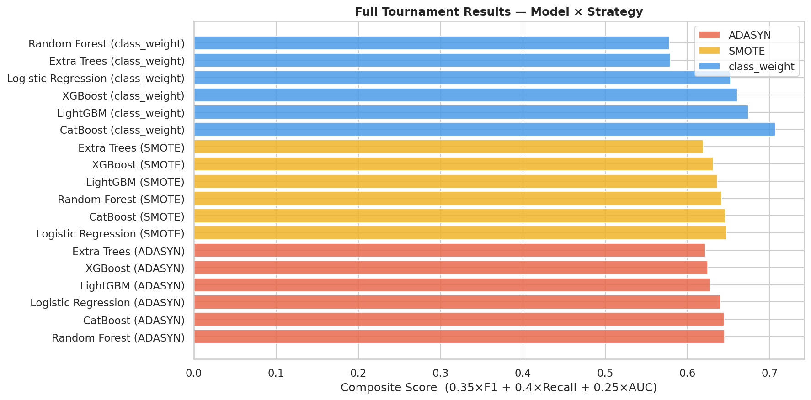
*18-combination tournament ranked by composite score (0.35×F1 + 0.40×Recall + 0.25×AUC). CatBoost + class_weight wins at 0.7068. The tournament reveals a nuanced pattern: the top 4 positions are all `class_weight` variants (CatBoost, LightGBM, XGBoost, Logistic Regression), but Random Forest and Extra Trees with `class_weight` rank dead last (17th and 18th) because their recall collapses to 0.43–0.44 — well below the 0.60 floor. The composite score's 0.40 recall weight penalises this heavily. CatBoost SMOTE ranks 6th with the highest F1 of any non-winner (0.608) but recall of only 0.546 keeps it out of the top tier.*

**Notable observations from the full ranking:**
- CatBoost achieves the best composite score but this is driven heavily by recall (0.703) — the highest of any tree-based model
- Logistic Regression with `class_weight` ranks 4th despite the lowest AUC (0.775), purely because it achieves the highest recall in the tournament (0.714). Its weak F1 (0.495) limits it from challenging the top 3
- Random Forest and Extra Trees with `class_weight` are the only two configurations that fail the 0.60 recall floor entirely, ranking below every SMOTE and ADASYN variant as a result
- CatBoost is the only model where `class_weight` dominates its own SMOTE and ADASYN variants — for every other boosting model, the strategy differences are relatively small in the 0.62–0.68 score band

### Final Model Performance

**Model:** CatBoost + `auto_class_weights='Balanced'` + Isotonic Calibration
**Operating threshold:** 0.442 (calibrated probabilities, recall floor = 0.60)

| Metric | Score | Target | Status |
|--------|-------|--------|--------|
| ROC-AUC | 0.8774 | ≥ 0.85 | ✅ PASS |
| Recall | 0.6176 | ≥ 0.60 | ✅ PASS |
| Precision | 0.7200 | ≥ 0.50 | ✅ PASS |
| F1 | 0.6649 | ≥ 0.55 | ✅ PASS |

From the confusion matrix at threshold = 0.442: **747** true negatives, **126** true positives, **78** false negatives, **49** false positives. Total errors: 127 out of 1,000 test customers (87.3% overall accuracy).

**Plain-language interpretation:** For every 100 customers who will actually churn, the model catches approximately 62 before they leave. Of the customers it flags as high-risk, roughly 72% are genuinely at risk — about 28% of outreach efforts will go to customers who would have stayed anyway. This trade-off is intentional: the cost of missing a churner exceeds the cost of one unnecessary retention call.

### Calibration

The uncalibrated CatBoost model was substantially miscalibrated — the reliability curve sits well below the diagonal from 0.1 to 0.7, meaning predicted probabilities significantly understated true churn rates across the critical mid-range. Most customers score in this band, so the practical effect is large: without correction, retention teams would see systematically lower-than-warranted risk scores.

After isotonic calibration, the curve closely tracks the diagonal through the operating range (0.0–0.55). The slight deviation above 0.75 reflects sparse data in the extreme high-probability region — a small-sample artefact, not a calibration failure.

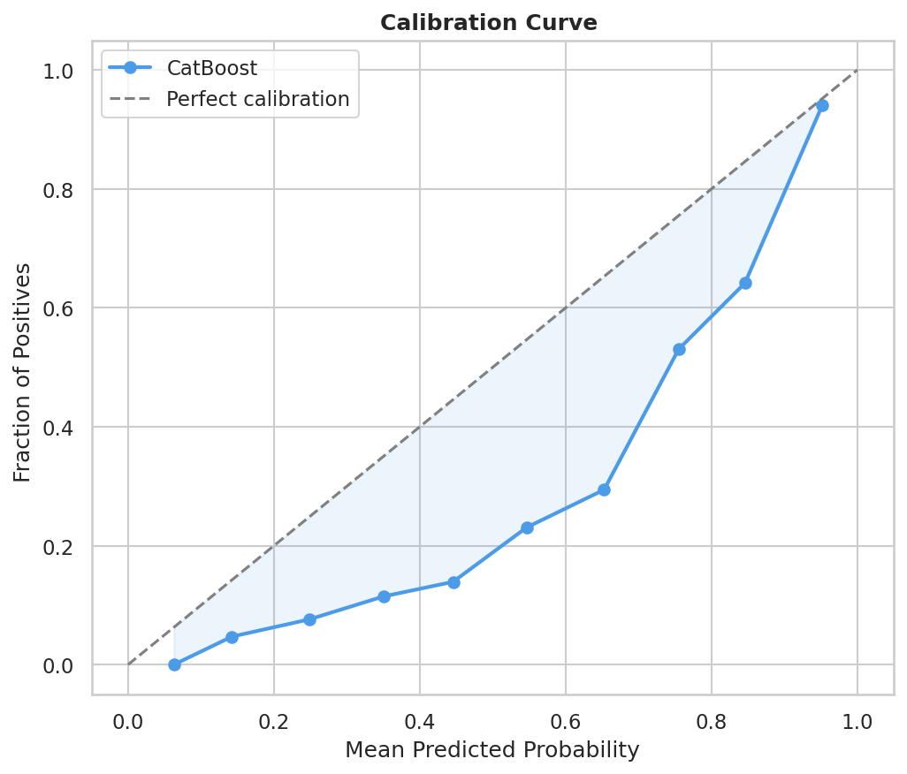
*Uncalibrated CatBoost — the reliability curve sits well below the diagonal across the 0.1–0.7 band. At a predicted probability of 0.45, the true observed churn rate is only ~0.14, meaning the model was substantially under-stating risk.*

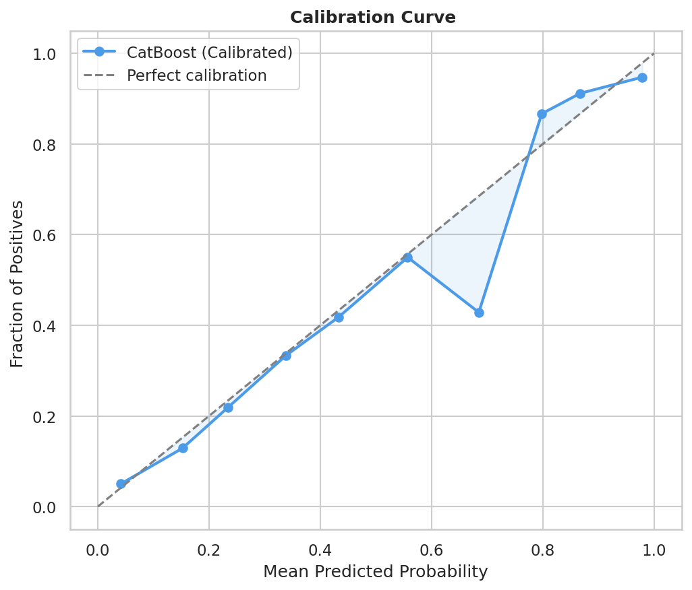
*After isotonic calibration — the curve closely follows the diagonal from 0.0 to ~0.55. Calibration re-scales the probability range, which is why the operating threshold shifts from 0.629 (uncalibrated) to 0.442 (calibrated).*

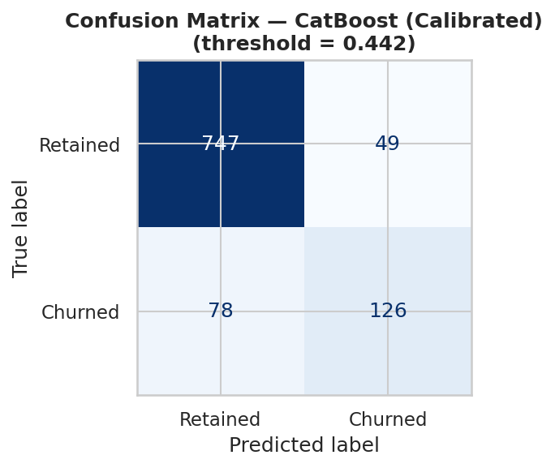
*Calibrated model at threshold = 0.442. 126 true positives caught vs 78 missed (recall = 61.8%). 49 false positives — a manageable false alarm rate for a retention team. The sub-0.5 threshold reflects the calibrated probability scale anchored to the true 20% base rate.*

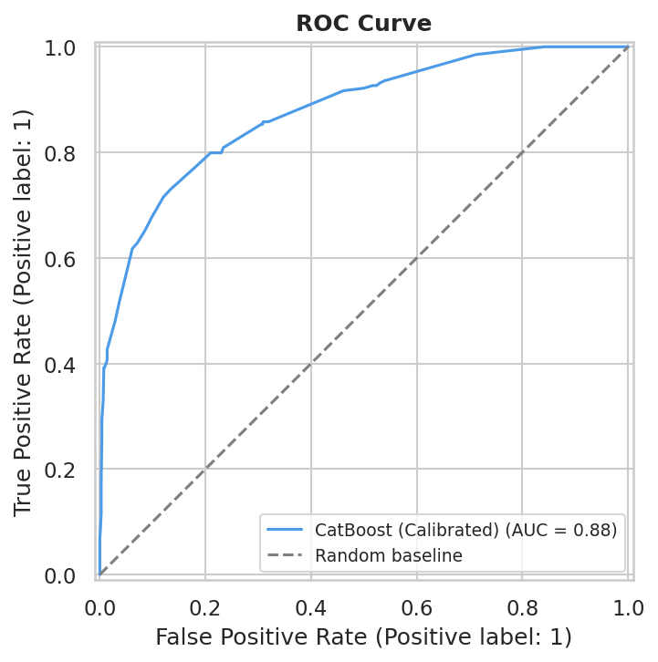
*ROC-AUC = 0.8774 — the model ranks a randomly chosen churner above a randomly chosen non-churner 87.7% of the time. The steep early rise (reaching ~0.80 TPR at only ~0.20 FPR) shows the model reliably concentrates the highest-risk customers at the top of the ranked list.*

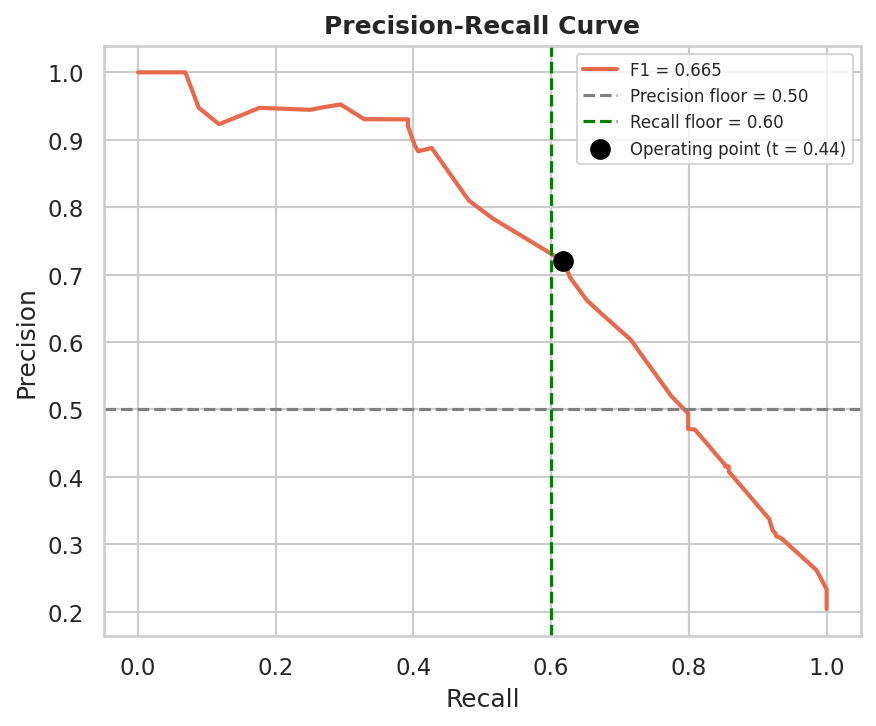
*Precision-Recall curve with the operating point at recall = 0.618, precision = 0.720 (t = 0.44). The curve maintains above 0.90 precision until recall ~0.40, reflecting strong confidence in the highest-risk predictions. The operating point sits right at the recall floor — deliberately chosen to maximise precision subject to the business constraint.*

### Error Analysis

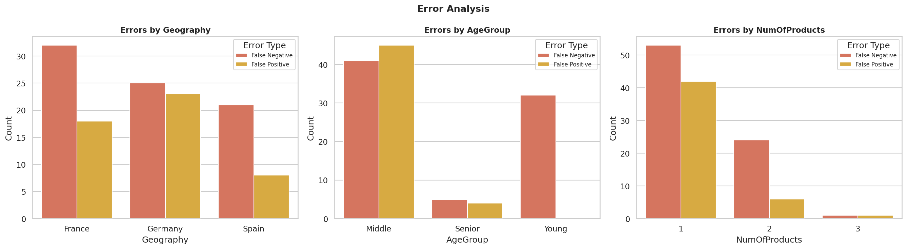

**By Geography:** France produces the most false negatives (~32) — expected given it has the largest customer base. Germany shows a disproportionately high false positive count (~23) relative to its size, consistent with the model over-predicting churn for German customers due to their 32.3% structural churn rate. Spain has the fewest false positives (~8).

**By Age Group:** Middle-aged customers (roughly 35–55) account for the largest share of both false negatives (~41) and false positives (~44) — the most ambiguous segment, straddling the age-based churn signal without cleanly landing in either the high-risk older band or the lower-risk younger band. Young customers produce ~32 false negatives but very few false positives, suggesting the model is appropriately conservative when it does flag young customers. Senior customers have very few errors overall.

**By NumOfProducts:** Single-product customers generate the most errors in both directions (FN ~52, FP ~42) — the model struggles to distinguish high-risk from low-risk holders within this large and heterogeneous group. 2-product customers have far fewer errors and almost no false positives, consistent with their 7.6% churn rate being the clearest signal in the dataset. 3-product customers show very few errors of either type.

### SHAP Interpretability

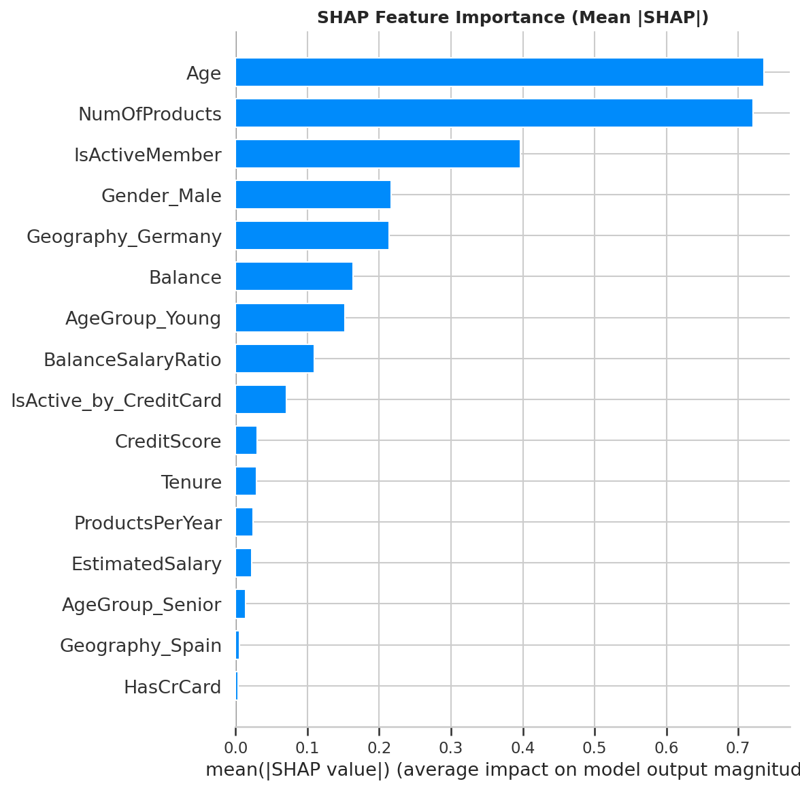

*Mean |SHAP| global importance. Age (~0.73) and NumOfProducts (~0.72) are nearly tied and dramatically dominant — together they account for the majority of predictive signal. IsActiveMember is a clear third at ~0.40. Everything from Balance (~0.16) downward contributes comparatively small marginal effects.*

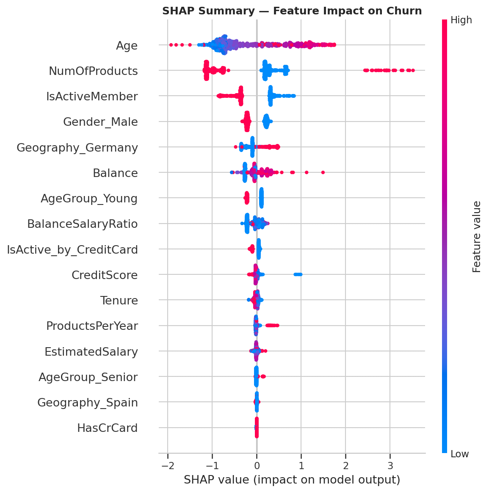

*Beeswarm plot — each dot is one test customer. High Age (red, right) strongly increases churn risk. NumOfProducts shows a bimodal pattern: low values (blue, left at -1) correspond to 2-product holders with very low risk; high values (red, far right at +3) correspond to 3–4 product holders with extreme churn rates. IsActiveMember = 0 (blue dots, right side) is a consistent risk amplifier. Gender_Male ranks 4th — male customers show a small but consistent protective effect.*

Feature ranking observations:
- **Age** is the single strongest predictor — directly explained by the KDE plot showing churned customers peak around 45 vs retained peaking around 35
- **NumOfProducts** ranks second; the SHAP values correctly capture the non-linear U-shaped pattern (2 products = safe, 1 or 3+ = risky) that would be impossible for a linear model to represent
- **Gender_Male** at 4th place should be interpreted carefully — it likely proxies correlated behavioural signals rather than being a direct causal driver
- **BalanceSalaryRatio** and **IsActive_by_CreditCard** (both engineered features) appear in the top 10, above raw features like CreditScore and Tenure — validating the feature construction decisions
- **HasCrCard** and **Geography_Spain** rank last, consistent with Spain's near-average churn rate (16.5%) and credit card ownership being a weak standalone signal

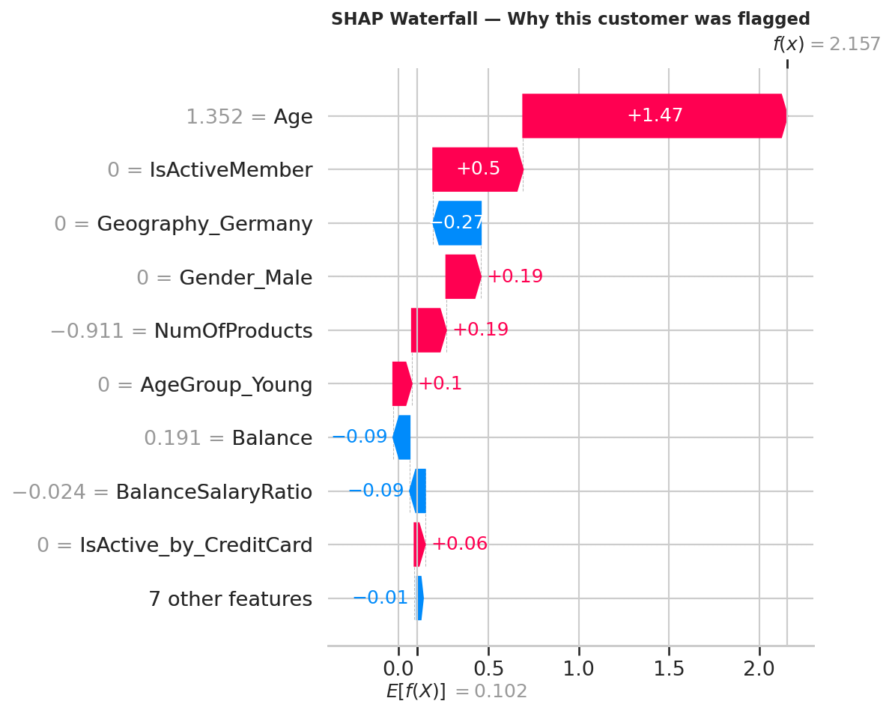

*Individual explanation for a true-positive churner. Starting from the base rate E[f(X)] = 0.102, Age drives the prediction up by +1.47 (the customer is older, scaled value 1.352). Inactivity adds +0.50. Notably, not being in Germany (Geography_Germany = 0) provides a protective -0.27 effect — confirming the model learned German geography as a risk amplifier whose absence is mildly reassuring. The combined push takes f(x) to 2.157 in log-odds space, well above the decision threshold.*

### Key Takeaways

- **`class_weight` dominates, but not uniformly.** CatBoost, LightGBM, and XGBoost with `class_weight` occupy the top 3 positions because they achieve both strong recall and strong F1. However, Random Forest and Extra Trees with `class_weight` rank dead last — their recall collapses to 0.43–0.44, below the business floor. The lesson is that `class_weight` works well when the model architecture is strong enough to exploit the reweighting; bagging-based ensembles appear less suited to this imbalance handling strategy on this dataset.

- **CatBoost's tournament win is recall-driven.** With a CV recall of 0.703 — highest among all tree-based models — CatBoost's composite score benefits most from the 0.40 recall weight. CatBoost SMOTE actually achieves a slightly higher F1 (0.608 vs 0.604) and AUC (0.858 vs 0.857) but its recall of 0.546 drops it to 6th place. The scoring function correctly identified the right winner for this business problem.

- **Calibration is not optional when showing probabilities to users.** The uncalibrated model understated true churn risk across the entire 0.1–0.7 band. Without isotonic correction, the Streamlit app would have displayed probabilities that gave retention teams false confidence. The calibrated threshold of 0.442 vs uncalibrated 0.629 illustrates how significantly the probability scale shifts.

- **The NumOfProducts non-linearity is the most operationally important finding.** Customers with 3–4 products churn at 81–100%. Any strategy that equates "more products = more loyalty" would be badly misled. The model correctly captures this as a bimodal risk signal, and SHAP confirms NumOfProducts is the #2 global feature.

- **Feature engineering added measurable signal.** Both `BalanceSalaryRatio` and `IsActive_by_CreditCard` rank in the SHAP top 10, above raw features like CreditScore, Tenure, and EstimatedSalary — validating the domain-driven construction decisions.

### Failed Experiments & Decisions

- **Two-pass Optuna (coarse + fine search)** was considered but dropped. TPE converges naturally with 150 trials in a single wide search — splitting into two phases added complexity with no measurable gain.

- **`Geo_Gender` interaction feature** was explored early. SHAP analysis showed it was redundant — Geography and Gender independently captured the same signal, and the interaction term did not rank in the top features.

- **`Zero_Balance_Flag`** (binary indicator for Balance = 0) was evaluated. SHAP impact was low relative to the continuous `Balance` feature, which captures the same signal with more granularity.

- **SMOTE + parallel CV** created CPU oversubscription on Colab, requiring a `n_jobs=1` guard for ImbPipeline. This overhead, combined with SMOTE's consistently weaker performance relative to `class_weight` for the top models, reinforced the decision to use native loss-function weighting for the final model.

### Limitations

- **Dataset scope.** The dataset contains 10,000 customers across three European geographies. Performance on different regional markets, product mixes, or time periods is untested.

- **No temporal validation.** The train/test split is random rather than time-based. A production churn model should be validated on a forward-looking holdout to detect temporal drift.

- **SHAP computed on uncalibrated inner classifier.** Calibration changes predicted probabilities but not feature attribution — waterfall plots accurately reflect what drove the score, but base values reflect uncalibrated log-odds space.

- **Threshold is fixed post-training.** The operating threshold is optimised once on training OOF predictions and fixed. In production, it should be periodically re-evaluated as class distributions shift over time.

- **10% test set size.** With ~204 churners in the test set, metric estimates carry non-trivial variance — reported numbers should be interpreted as estimates within a few percentage points.

---

## Visualizations

All plots are generated automatically during the notebook run and saved to `reports/figures/`. To regenerate, run sections 4–12 of the notebook.

### EDA

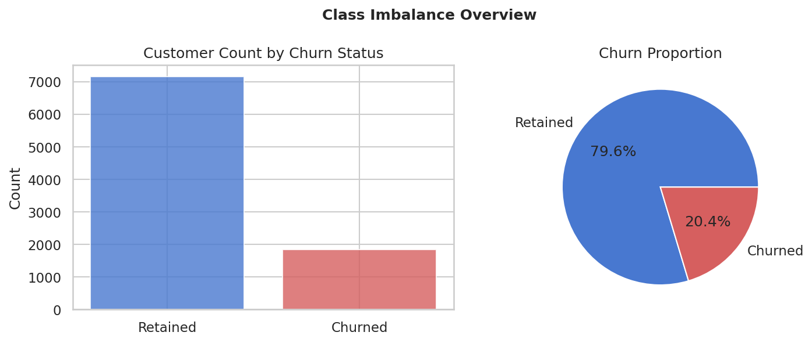
*79.6% retained vs 20.4% churned. Naive accuracy of ~80% sets the baseline any model must beat meaningfully.*

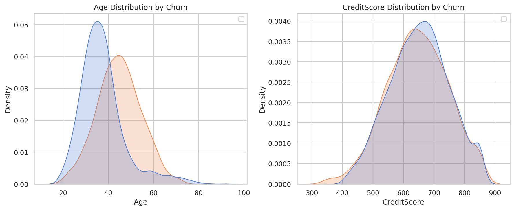
*Age (left): churned customers peak around 45, retained around 35 — the clearest distributional separation in the dataset, explaining Age's #1 SHAP ranking. Credit score (right): near-identical KDEs for both classes, consistent with its 10th-place SHAP ranking.*

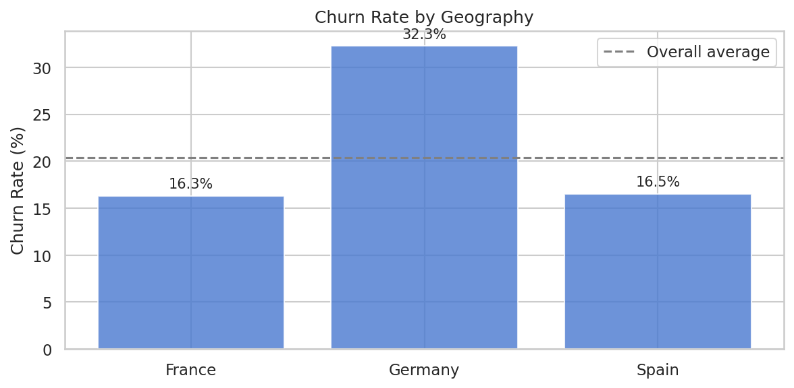
*Germany's 32.3% churn rate is nearly double France (16.3%) and Spain (16.5%). This structural gap makes `Geography_Germany` a genuine model signal — 5th in SHAP importance — and explains Germany's disproportionate false positive rate in the error analysis.*

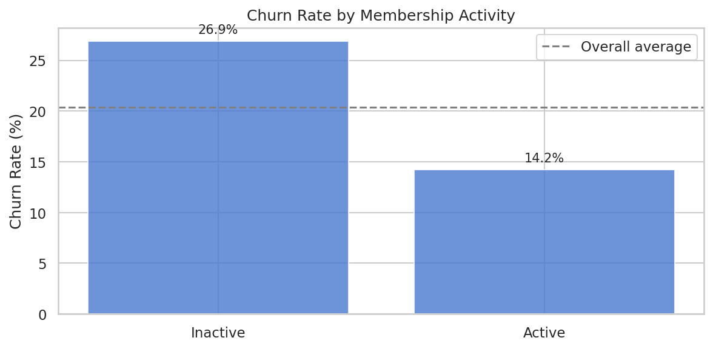
*Inactive members churn at 26.9% vs 14.2% for active — a 1.9× difference. `IsActiveMember` is the 3rd strongest SHAP feature. Its interaction with credit card usage (`IsActive_by_CreditCard`) also makes the SHAP top 10.*

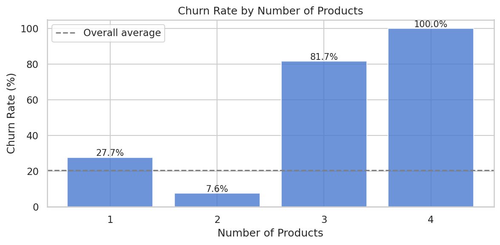
*The most striking EDA pattern: 2-product customers churn at just 7.6%, while 3-product (81.7%) and 4-product (100%) customers show extreme churn rates. This non-linear U-shape signals service friction at high relationship complexity — and is exactly what makes NumOfProducts the #2 SHAP feature.*

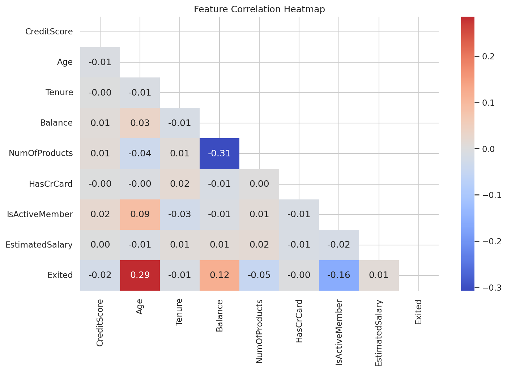
*No feature pair exceeds the 0.7 multicollinearity threshold. The strongest correlations with Exited are Age (0.29) and IsActiveMember (-0.16), closely matching their SHAP rankings.*

### Threshold Selection

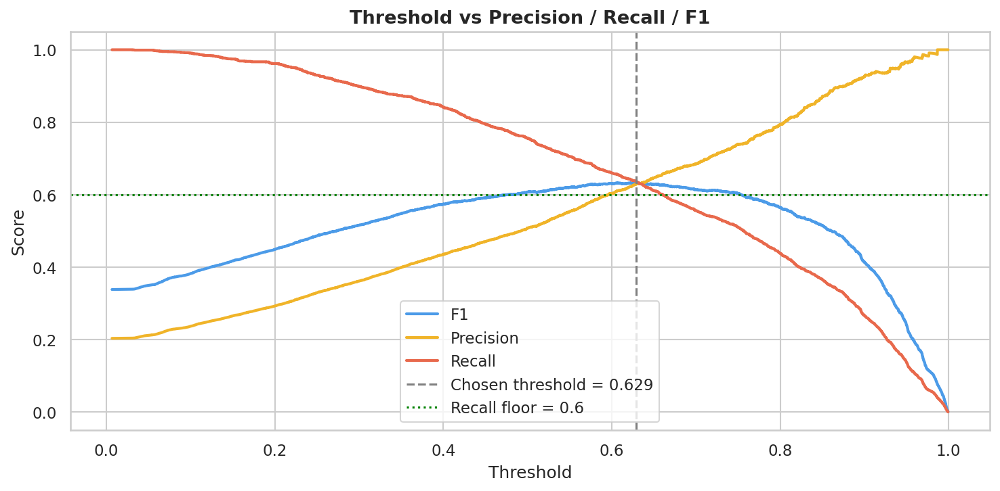
*Precision (orange), Recall (red), and F1 (blue) vs decision threshold on uncalibrated OOF probabilities. The chosen threshold of 0.629 is where F1 peaks while recall exactly meets the 0.60 floor. Post-calibration, this maps to 0.442 on the compressed probability scale.*

---

## Deployment

The trained pipeline is deployed at **[https://bank-churnprediction.streamlit.app/](https://bank-churnprediction.streamlit.app/)**.

**Single Customer tab:** Form-based input → real-time churn probability via a Plotly gauge, confidence classification (Borderline / Moderate / Strong based on margin from threshold), SHAP waterfall plot, top 5 risk factors ranked by |SHAP|, and up to 3 SHAP-driven retention recommendations mapped to specific banking actions.

**Batch Prediction tab:** CSV upload → probability scores and risk labels for all customers, sortable results table, downloadable CSV, and row-level drill-down for any selected customer.

**Model Information footer:** Plain-language metric interpretation for a non-technical banking audience, including practical guidance on the precision vs recall trade-off for retention teams.

Key design decisions:
- Risk labels (`High` / `Elevated` / `Low`) derived from the actual model threshold — not hardcoded bands
- Retention recommendations are SHAP-driven: top positive-SHAP features per customer map to specific retention actions
- Confidence uses margin-based zones (distance from threshold) — not raw probability magnitude
- SHAP applied to the uncalibrated inner pipeline — calibration changes probabilities but not feature attribution

To run locally:

```bash
git clone https://github.com/narendrapatel6321-dotcom/bank_churn_prediction.git
cd bank_churn_prediction
pip install -r requirements.txt
streamlit run app.py
```

---

## Inference

```python
import joblib
import pandas as pd

# Load pipeline and threshold
pipeline  = joblib.load("models/CatBoost_final_pipeline.joblib")
threshold = joblib.load("models/CatBoost_threshold.joblib")  # 0.442

# Single customer — raw input features, no preprocessing needed
customer = pd.DataFrame([{
    "CreditScore":     650,
    "Geography":       "Germany",
    "Gender":          "Female",
    "Age":             45,
    "Tenure":          3,
    "Balance":         120000.0,
    "NumOfProducts":   1,
    "HasCrCard":       1,
    "IsActiveMember":  0,
    "EstimatedSalary": 75000.0,
}])

proba      = pipeline.predict_proba(customer)[0, 1]
prediction = "CHURN" if proba >= threshold else "RETAIN"

print(f"Churn probability : {proba:.1%}")
print(f"Prediction        : {prediction}  (threshold = {threshold:.3f})")
```

The pipeline handles all feature engineering and preprocessing internally. Pass raw input features matching the original dataset schema — minus `RowNumber`, `CustomerId`, `Surname`, and `Exited`.

---

## Reproducibility

```python
SEED = 21

train_test_split(..., random_state=SEED)
StratifiedKFold(..., random_state=SEED)
CatBoostClassifier(..., random_seed=SEED)
optuna.samplers.TPESampler(seed=42)   # Optuna uses its own seed parameter
SMOTE(random_state=42)
```

> **Note:** Results may vary slightly across runs due to non-deterministic behaviour in CatBoost's parallel tree building. The numbers reported here were obtained on Google Colab (CPU). Optuna trial ordering may differ, but the best found configuration should be within noise of the reported values at 150 trials.

---

## Requirements

```
Python          >= 3.10
scikit-learn    >= 1.3
catboost
xgboost
lightgbm
imbalanced-learn
optuna
shap
streamlit
pandas
numpy
matplotlib
seaborn
plotly
joblib
requests
```

```bash
pip install scikit-learn catboost xgboost lightgbm imbalanced-learn optuna shap streamlit pandas numpy matplotlib seaborn plotly joblib requests
```

---

## How to Run

### Training (Google Colab)

Open `colab_notebook.ipynb` as a Colab notebook and run all cells in order. Helper modules download automatically from GitHub at the start of Section 1 — no manual setup needed. Section 14 pushes all models, reports, and figures to GitHub automatically; a `GITHUB_TOKEN` Colab secret is required for that step.

### Streamlit App (Local)

```bash
git clone https://github.com/narendrapatel6321-dotcom/bank_churn_prediction.git
cd bank_churn_prediction
pip install -r requirements.txt
streamlit run app.py
```
